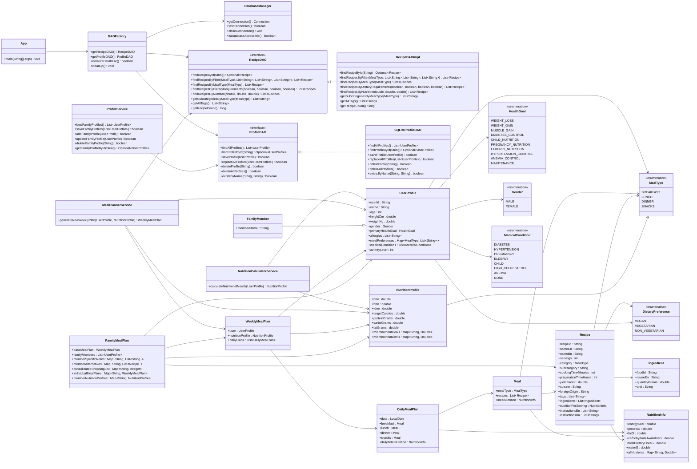

# Pusti-Tusti UML Class Diagram

```mermaid
classDiagram
direction LR

class App {
	+main(String[] args) void
}

class DAOFactory {
	+getRecipeDAO() RecipeDAO
	+getProfileDAO() ProfileDAO
	+initializeDatabase() boolean
	+cleanup() void
}

class DatabaseManager {
	+getConnection() Connection
	+testConnection() boolean
	+closeConnection() void
	+isDatabaseAccessible() boolean
}

class RecipeDAO {
	<<interface>>
	+findRecipeById(String) Optional~Recipe~
	+findRecipesByFilter(MealType, List~String~, List~String~, List~String~) List~Recipe~
	+findRecipesByMealType(MealType) List~Recipe~
	+findRecipesByDietaryRequirements(boolean, boolean, boolean, boolean) List~Recipe~
	+findRecipesByNutrition(double, double, double) List~Recipe~
	+getSubcategoriesByMealType(MealType) List~String~
	+getAllTags() List~String~
	+getRecipeCount() long
}

class RecipeDAOImpl {
	+findRecipeById(String) Optional~Recipe~
	+findRecipesByFilter(MealType, List~String~, List~String~, List~String~) List~Recipe~
	+findRecipesByMealType(MealType) List~Recipe~
	+findRecipesByDietaryRequirements(boolean, boolean, boolean, boolean) List~Recipe~
	+findRecipesByNutrition(double, double, double) List~Recipe~
	+getSubcategoriesByMealType(MealType) List~String~
	+getAllTags() List~String~
	+getRecipeCount() long
}

class ProfileDAO {
	<<interface>>
	+findAllProfiles() List~UserProfile~
	+findProfileById(String) Optional~UserProfile~
	+saveProfile(UserProfile) boolean
	+replaceAllProfiles(List~UserProfile~) boolean
	+deleteProfile(String) boolean
	+deleteAllProfiles() boolean
	+existsByName(String, String) boolean
}

class SQLiteProfileDAO {
	+findAllProfiles() List~UserProfile~
	+findProfileById(String) Optional~UserProfile~
	+saveProfile(UserProfile) boolean
	+replaceAllProfiles(List~UserProfile~) boolean
	+deleteProfile(String) boolean
	+deleteAllProfiles() boolean
	+existsByName(String, String) boolean
}

class ProfileService {
	+loadFamilyProfiles() List~UserProfile~
	+saveFamilyProfiles(List~UserProfile~) boolean
	+addFamilyProfile(UserProfile) boolean
	+updateFamilyProfile(UserProfile) boolean
	+deleteFamilyProfile(String) boolean
	+getFamilyProfileById(String) Optional~UserProfile~
}

class NutritionCalculatorService {
	+calculateNutritionalNeeds(UserProfile) NutritionProfile
}

class MealPlannerService {
	+generateNewWeeklyPlan(UserProfile, NutritionProfile) WeeklyMealPlan
}

class UserProfile {
	+userId : String
	+name : String
	+age : int
	+heightCm : double
	+weightKg : double
	+gender : Gender
	+primaryHealthGoal : HealthGoal
	+allergies : List~String~
	+mealPreferences : Map~MealType, List~String~~
	+medicalConditions : List~MedicalCondition~
	+activityLevel : int
}

class FamilyMember {
	+memberName : String
}

class NutritionProfile {
	+bmi : double
	+bmr : double
	+tdee : double
	+targetCalories : double
	+proteinGrams : double
	+carbsGrams : double
	+fatGrams : double
	+micronutrientGoals : Map~String, Double~
	+micronutrientLimits : Map~String, Double~
}

class WeeklyMealPlan {
	+user : UserProfile
	+nutritionProfile : NutritionProfile
	+dailyPlans : List~DailyMealPlan~
}

class DailyMealPlan {
	+date : LocalDate
	+breakfast : Meal
	+lunch : Meal
	+dinner : Meal
	+snacks : Meal
	+dailyTotalNutrition : NutritionInfo
}

class FamilyMealPlan {
	+baseMealPlan : WeeklyMealPlan
	+familyMembers : List~UserProfile~
	+memberSpecificNotes : Map~String, List~String~~
	+memberAlternatives : Map~String, List~Recipe~~
	+consolidatedShoppingList : Map~String, Integer~
	+individualMealPlans : Map~String, WeeklyMealPlan~
	+memberNutritionProfiles : Map~String, NutritionProfile~
}

class Meal {
	+mealType : MealType
	+recipes : List~Recipe~
	+mealNutrition : NutritionInfo
}

class Recipe {
	+recipeId : String
	+nameEn : String
	+nameBn : String
	+servings : int
	+category : MealType
	+subcategory : String
	+cookingTimeMinutes : int
	+preparationTimeHours : int
	+yieldFactor : double
	+cuisine : String
	+foreignOrigin : String
	+tags : List~String~
	+ingredients : List~Ingredient~
	+nutritionPerServing : NutritionInfo
	+instructionsEn : List~String~
	+instructionsBn : List~String~
}

class Ingredient {
	+foodId : String
	+nameEn : String
	+quantityGrams : double
	+unit : String
}

class NutritionInfo {
	+energyKcal : double
	+proteinG : double
	+fatG : double
	+carbohydrateAvailableG : double
	+totalDietaryFibreG : double
	+waterG : double
	+allNutrients : Map~String, Double~
}

class MealType {
	<<enumeration>>
	BREAKFAST
	LUNCH
	DINNER
	SNACKS
}

class HealthGoal {
	<<enumeration>>
	WEIGHT_LOSS
	WEIGHT_GAIN
	MUSCLE_GAIN
	DIABETES_CONTROL
	CHILD_NUTRITION
	PREGNANCY_NUTRITION
	ELDERLY_NUTRITION
	HYPERTENSION_CONTROL
	ANEMIA_CONTROL
	MAINTENANCE
}

class Gender {
	<<enumeration>>
	MALE
	FEMALE
}

class MedicalCondition {
	<<enumeration>>
	DIABETES
	HYPERTENSION
	PREGNANCY
	ELDERLY
	CHILD
	HIGH_CHOLESTEROL
	ANEMIA
	NONE
}

class DietaryPreference {
	<<enumeration>>
	VEGAN
	VEGETARIAN
	NON_VEGETARIAN
}

App --> DAOFactory
DAOFactory --> RecipeDAO
DAOFactory --> ProfileDAO
DAOFactory --> DatabaseManager
RecipeDAO <|.. RecipeDAOImpl
ProfileDAO <|.. SQLiteProfileDAO
ProfileService --> ProfileDAO
NutritionCalculatorService --> UserProfile
NutritionCalculatorService --> NutritionProfile
MealPlannerService --> RecipeDAO
MealPlannerService --> UserProfile
MealPlannerService --> NutritionProfile
MealPlannerService --> WeeklyMealPlan

UserProfile --> Gender
UserProfile --> HealthGoal
UserProfile --> MedicalCondition
UserProfile --> MealType
FamilyMember --|> UserProfile

WeeklyMealPlan --> UserProfile
WeeklyMealPlan --> NutritionProfile
WeeklyMealPlan --> DailyMealPlan
DailyMealPlan --> Meal
DailyMealPlan --> NutritionInfo
FamilyMealPlan --> WeeklyMealPlan
FamilyMealPlan --> UserProfile
FamilyMealPlan --> Recipe
FamilyMealPlan --> NutritionProfile

Meal --> MealType
Meal --> Recipe
Meal --> NutritionInfo
Recipe --> MealType
Recipe --> Ingredient
Recipe --> NutritionInfo
Recipe --> DietaryPreference
UserProfile --> DietaryPreference
NutritionProfile --> MealType
```