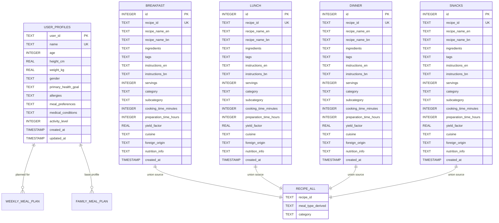

# Pusti-Tusti ER Diagram

```mermaid
erDiagram
	USER_PROFILES {
		TEXT user_id PK
		TEXT name UK
		INTEGER age
		REAL height_cm
		REAL weight_kg
		TEXT gender
		TEXT primary_health_goal
		TEXT allergies
		TEXT meal_preferences
		TEXT medical_conditions
		INTEGER activity_level
		TIMESTAMP created_at
		TIMESTAMP updated_at
	}

	BREAKFAST {
		INTEGER id PK
		TEXT recipe_id UK
		TEXT recipe_name_en
		TEXT recipe_name_bn
		TEXT ingredients
		TEXT tags
		TEXT instructions_en
		TEXT instructions_bn
		INTEGER servings
		TEXT category
		TEXT subcategory
		INTEGER cooking_time_minutes
		INTEGER preparation_time_hours
		REAL yield_factor
		TEXT cuisine
		TEXT foreign_origin
		TEXT nutrition_info
		TIMESTAMP created_at
	}

	LUNCH {
		INTEGER id PK
		TEXT recipe_id UK
		TEXT recipe_name_en
		TEXT recipe_name_bn
		TEXT ingredients
		TEXT tags
		TEXT instructions_en
		TEXT instructions_bn
		INTEGER servings
		TEXT category
		TEXT subcategory
		INTEGER cooking_time_minutes
		INTEGER preparation_time_hours
		REAL yield_factor
		TEXT cuisine
		TEXT foreign_origin
		TEXT nutrition_info
		TIMESTAMP created_at
	}

	DINNER {
		INTEGER id PK
		TEXT recipe_id UK
		TEXT recipe_name_en
		TEXT recipe_name_bn
		TEXT ingredients
		TEXT tags
		TEXT instructions_en
		TEXT instructions_bn
		INTEGER servings
		TEXT category
		TEXT subcategory
		INTEGER cooking_time_minutes
		INTEGER preparation_time_hours
		REAL yield_factor
		TEXT cuisine
		TEXT foreign_origin
		TEXT nutrition_info
		TIMESTAMP created_at
	}

	SNACKS {
		INTEGER id PK
		TEXT recipe_id UK
		TEXT recipe_name_en
		TEXT recipe_name_bn
		TEXT ingredients
		TEXT tags
		TEXT instructions_en
		TEXT instructions_bn
		INTEGER servings
		TEXT category
		TEXT subcategory
		INTEGER cooking_time_minutes
		INTEGER preparation_time_hours
		REAL yield_factor
		TEXT cuisine
		TEXT foreign_origin
		TEXT nutrition_info
		TIMESTAMP created_at
	}

	RECIPE_ALL {
		TEXT recipe_id
		TEXT meal_type_derived
		TEXT category
	}

	USER_PROFILES ||--o{ WEEKLY_MEAL_PLAN : "planned for"
	USER_PROFILES ||--o{ FAMILY_MEAL_PLAN : "base profile"

	BREAKFAST ||--|| RECIPE_ALL : "union source"
	LUNCH ||--|| RECIPE_ALL : "union source"
	DINNER ||--|| RECIPE_ALL : "union source"
	SNACKS ||--|| RECIPE_ALL : "union source"
```

Note: `RECIPE_ALL` is a database view created by `DatabaseManager`; the four meal tables are the physical sources.